#### 初步展示开发效果, 后续再进一步完善

1.后台管理员登陆, 对网站商品信息进行操作

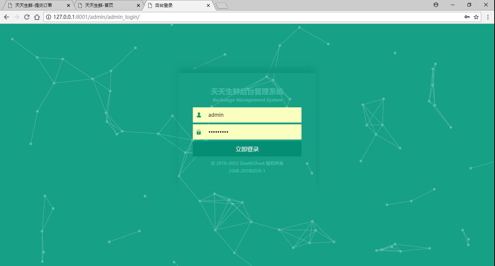

2.后台登陆后进入首页, 展示对商品动态情况进行数据分析 (后续完成)

3.后台上架新商品

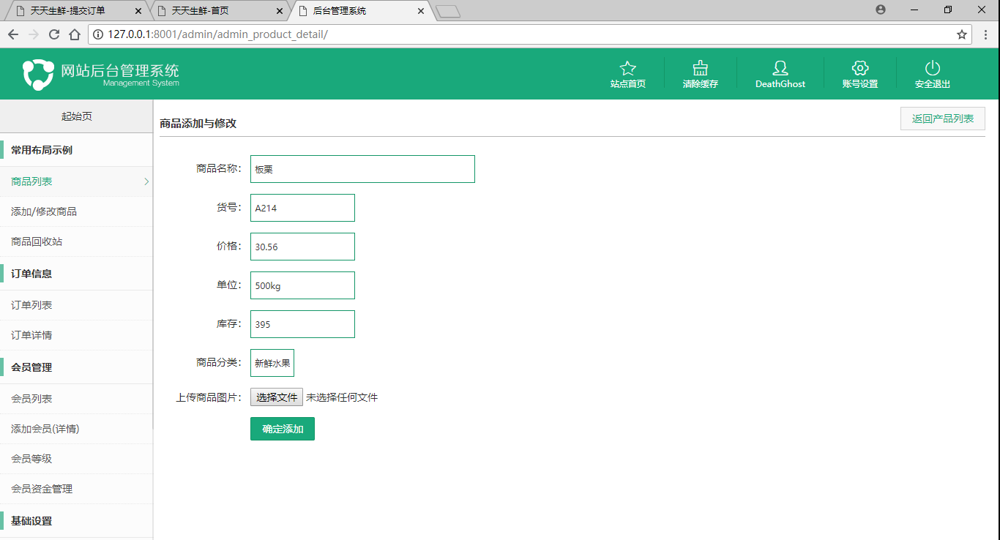

4.后台查看上架的商品, 并可对商品进行信息修改及删除到回收站

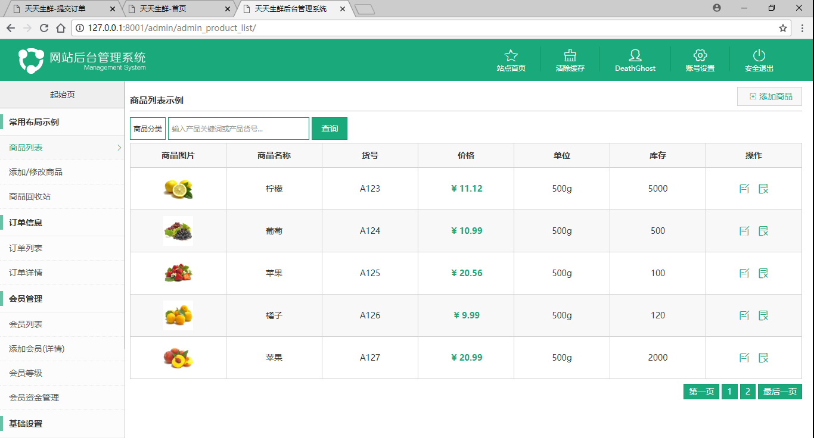

5.管理员对商品信息进行修改

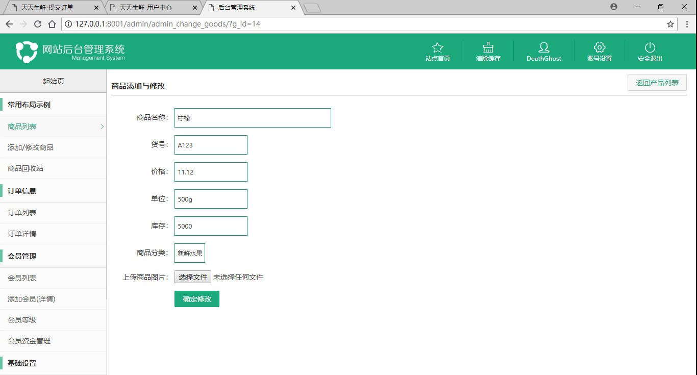

6.拉入回收站的商品可进行撤销操作与彻底删除商品  (后台管理其他内容稍后开发)

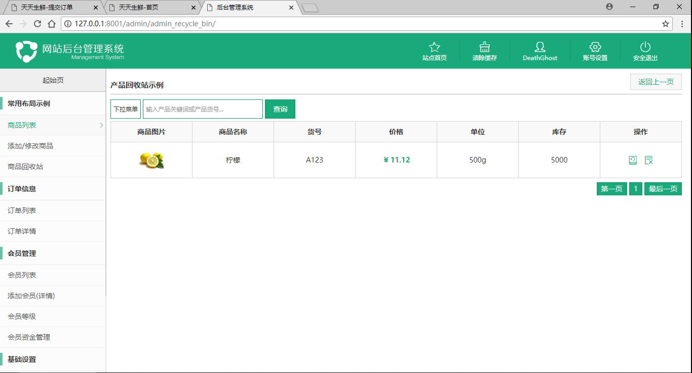

7.电商网站用户注册

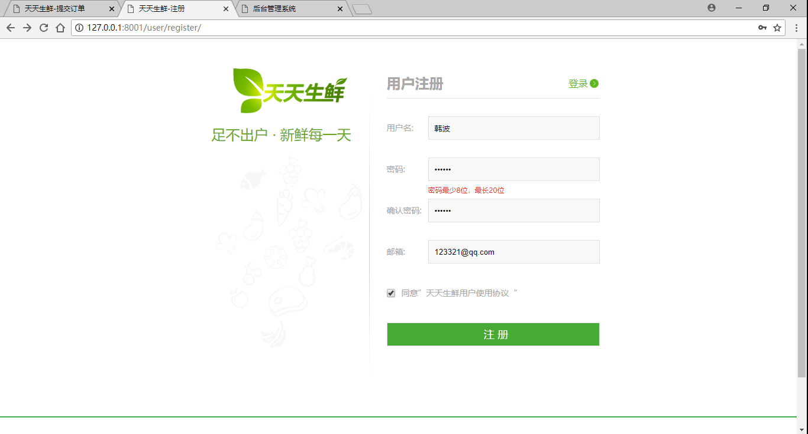

8.电商网站用户登录

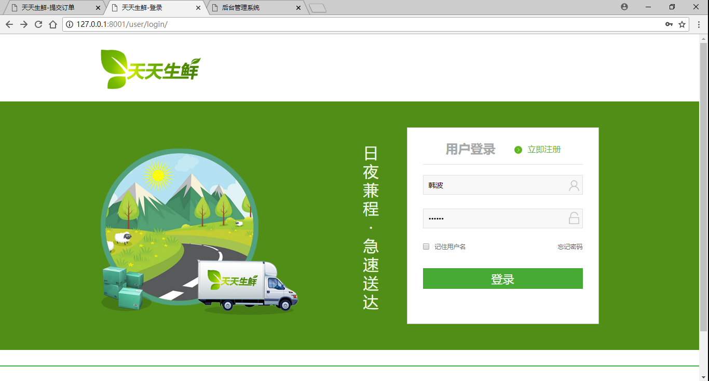

9.电商网站首页, 用户登陆后可对商品进行查看购买

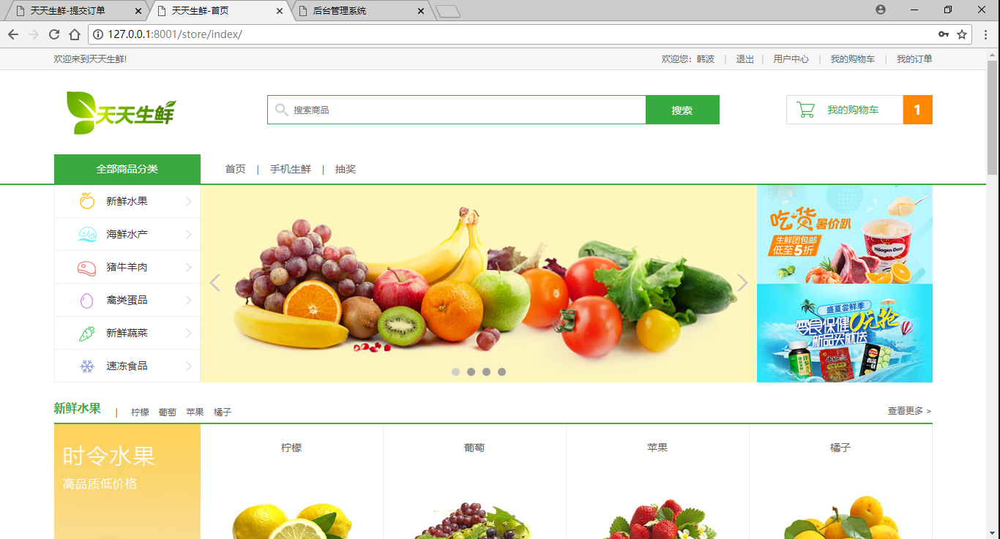

10.查看更多商品列表

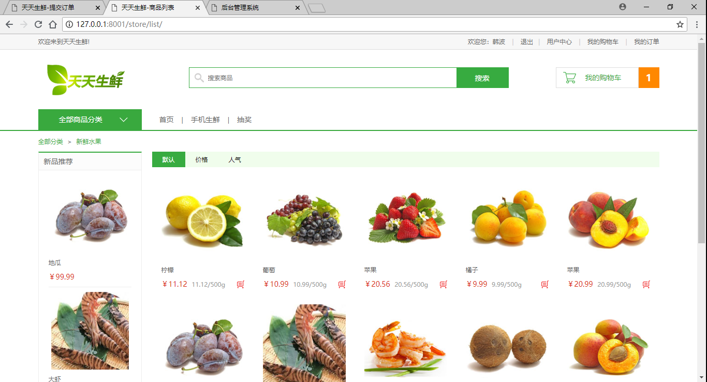

11.查看商品详情, 可对商品预想购买数量进行加减操作, 以及相应的该商品总价

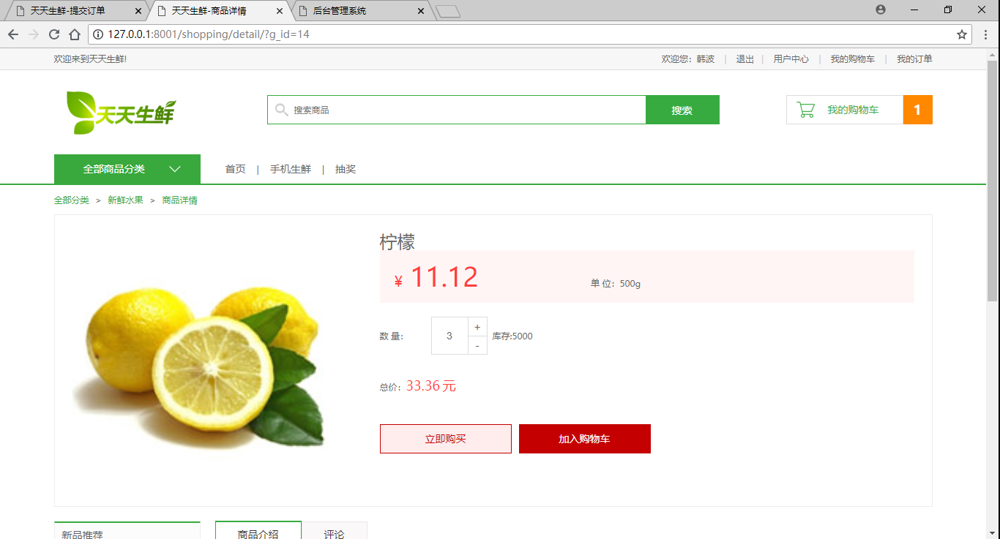

12.同样操作添加另外商品到购物车

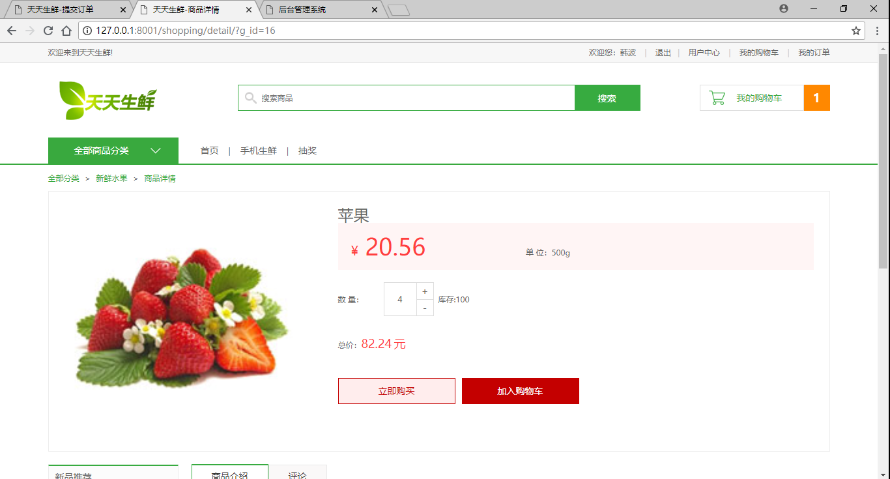

13.商品默认购买1件, 当减到1时会提示亲

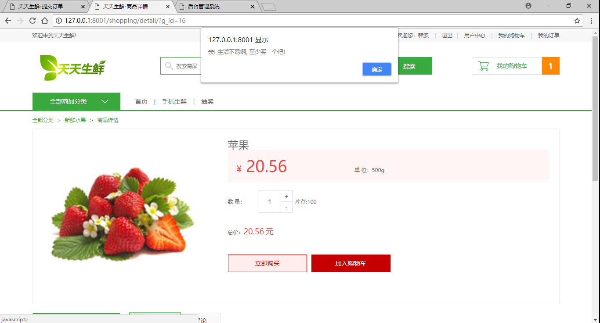

14.在购物车中可对商品数量可再次进行加减与删除商品,  以及查看商品总价格

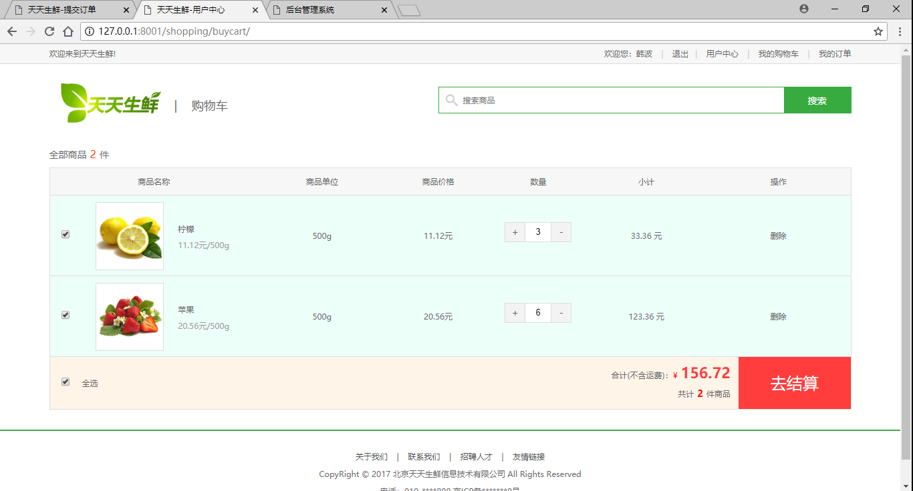

15.进入确认页, 对商品信息进行, 价格进行确认后提交订单

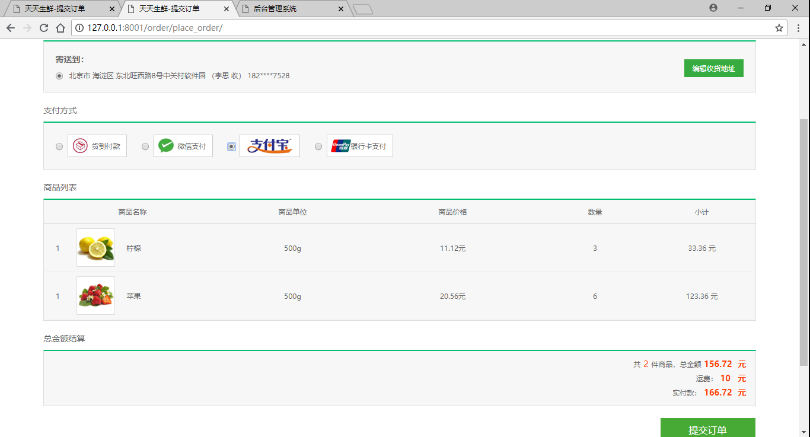

16.后续功能开发中..........

